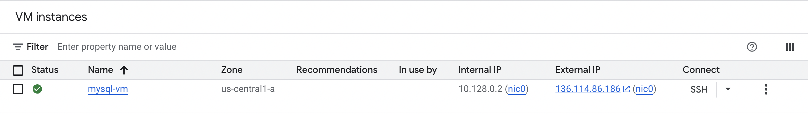
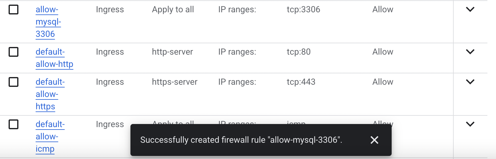
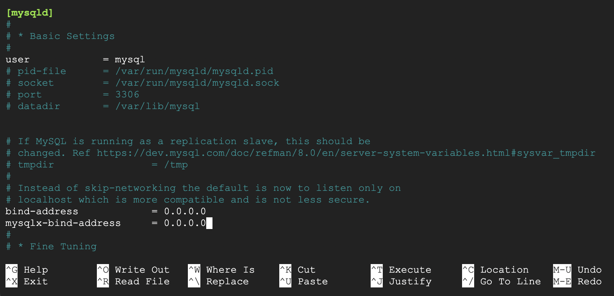
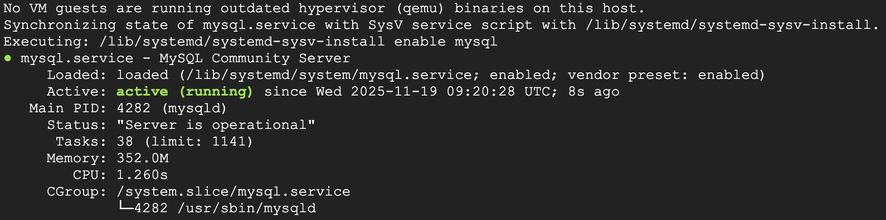
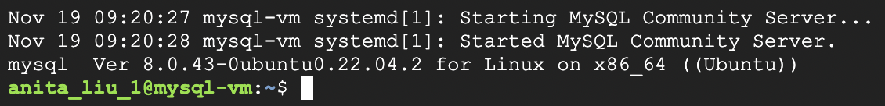
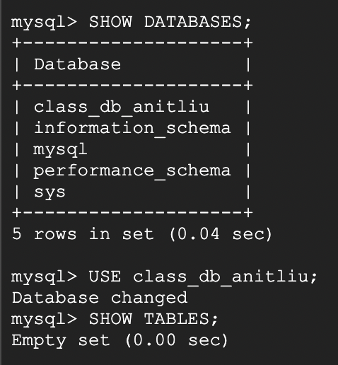
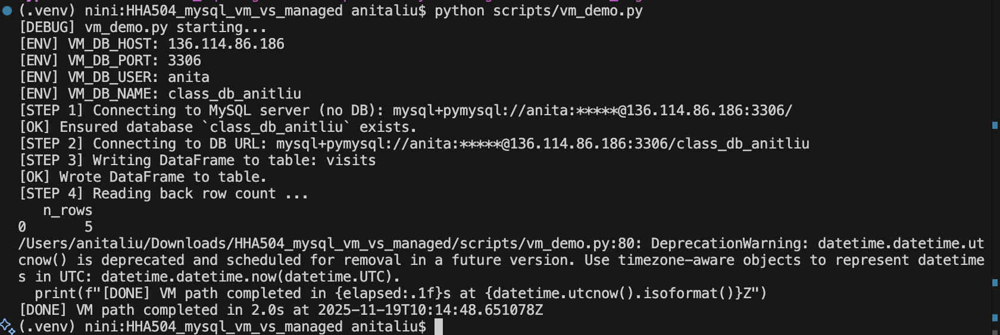
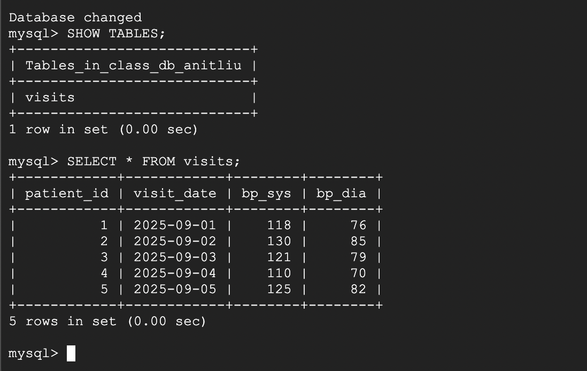

# HHA504 – MySQL on VM vs Managed (GCP + SQLAlchemy + pandas)

This project compares two ways to run MySQL on GCP: a self-managed MySQL server on a Compute Engine VM and a fully managed Cloud SQL instance. Both setups create the same database and table using Python, allowing you to see the difference between managing everything yourself versus using Google’s managed service.

1. **Self-managed MySQL on a Google Compute Engine VM**
2. **Managed MySQL using Cloud SQL for MySQL**

Both are accessed from Python using **SQLAlchemy + pandas**. 
Each script:

- Loads credentials from `.env`
- Ensures a database exists
- Creates a `visits` table via `pandas.to_sql`
- Inserts 5 rows
- Reads back the row count with `pd.read_sql`

## 1. Cloud & Region

- **Cloud:** Google Cloud Platform  
- **VM zone:** `us-central1-a` 
- **Cloud SQL region:** `us-central1`  
- **Video Link:** [Tutorial](https://drive.google.com/file/d/1c6hXg7J6sjG51a35Pkng9d9ED92E2jvA/view?usp=sharing)

## 2. Repository Layout

```text
HHA504_mysql_vm_vs_managed/
├── README.md
├── .gitignore              # ignore .env
├── .env.example            # template; no real secrets
├── scripts/
│   ├── vm_demo.py          # SQLAlchemy+pandas against VM MySQL
│   └── managed_demo.py     # SQLAlchemy+pandas against Cloud SQL
├── sql/
│   └── init.sql            # optional bootstrap
├── screenshots/
│   ├── vm/                 # VM portal, firewall, CLI, queries
│   └── managed/            # Cloud SQL creation + queries
└── docs/
    ├── setup_notes_vm.md
    ├── setup_notes_managed.md
    └── comparison.md
```


## Steps
### VM Path

- Create a Firewall Rule for **port 3306**
- Create a **GCP Compute Engine VM Ubuntu**
- SSH into VM , update, and install MySQL server  
  (`sudo apt update`, `sudo apt install mysql-server`)
- Create MySQL database and user with external access
- Edit MySQL config using nano:  
  `/etc/mysql/mysql.conf.d/mysqld.cnf` to set `bind-address = 0.0.0.0`
- Restart MySQL service using`sudo systemctl restart mysql`
- Update `.env` with VM database connection info
- Run: ``python scripts/vm_demo.py``

### Managed Path
- Create Cloud SQL MySQL 8.0 instance (public IP enabled)
- Add 0.0.0.0/0 to Authorized Networks
- Create database class_db_anitliu
- Open Cloud Shell: ``gcloud sql connect mysql-managed --user=root --quiet``
- Create MySQL user anita with full privileges
- Update .env with Cloud SQL connection info
- Run: ``python scripts/managed_demo.py``

## Screenshots
### VM Screenshots











### Managed Screenshots


