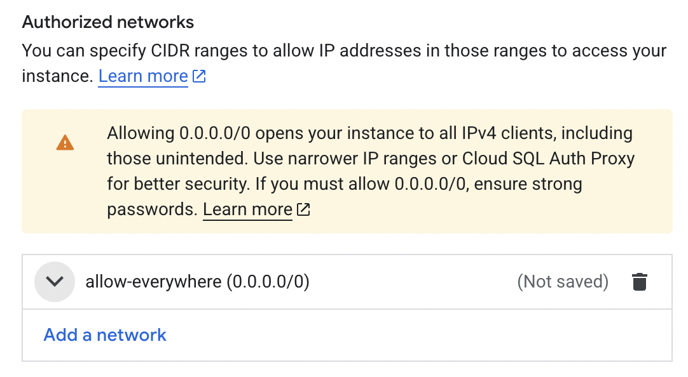
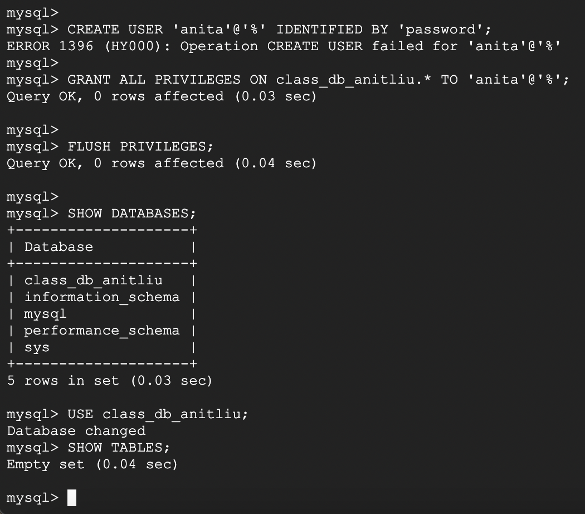
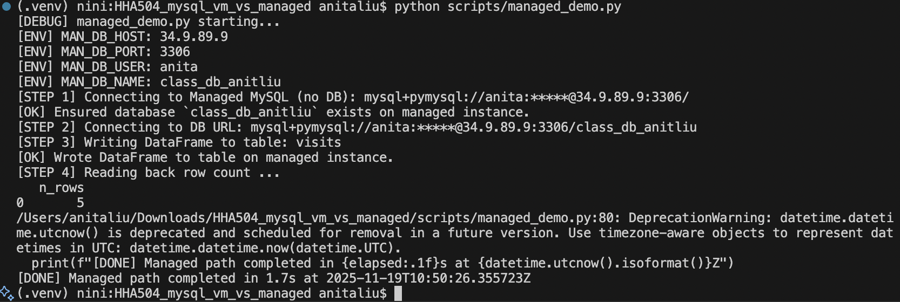
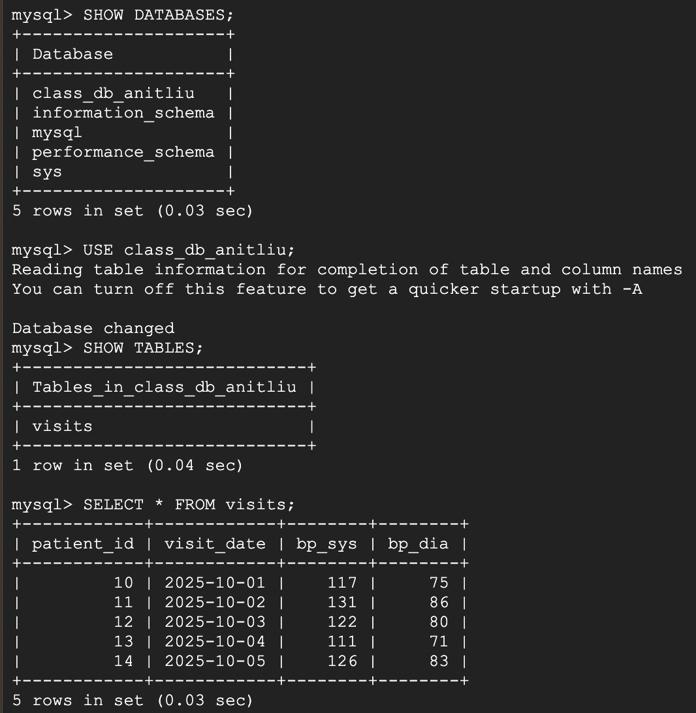

# Setup Notes: Managed MySQL Using Cloud SQL (GCP)

## 1. Create Cloud SQL Instance (MySQL)

- Go to **SQL** and then **Create Instance**
- Select **MySQL**
- Set:
  - Instance ID: `mysql-managed`
  - Engine: **MySQL 8.0**
  - Region: **us-central1**
  - Set root password: `password`
- Click **Create**

## 2. Configure Public Networking (Authorized Networks)

- I added a public IP allowlist to permit remote connections.

- Open the **mysql-managed** SQL instance
- Go to **Connections**
- Scroll to **Authorized Networks**
- Add a network:
   - Name: `allow-all`
   - Network: `0.0.0.0/0`
- Save

## 3. Connect via Cloud Shell

- To connect via root user: ``gcloud sql connect mysql-managed --user=root --quiet``
    If the SQL Admin API was disabled, I enabled it following the error message link.

## 4. Create Database and User Inside Cloud SQL
- Once connected through Cloud Shell: ``CREATE DATABASE class_db_anitliu;CREATE USER 'anita'@'%' IDENTIFIED BY 'password'; GRANT ALL PRIVILEGES ON class_db_anitliu.* TO 'anita'@'%'; FLUSH PRIVILEGES;``

- Verify that the database exists

## 5. Python
- My .env is 
    MAN_DB_HOST=34.9.89.9
    MAN_DB_PORT=3306
    MAN_DB_USER=anita
    MAN_DB_PASS=password
    MAN_DB_NAME=class_db_anitliu
- I also installed these dependencies ``pip install sqlalchemy pymysql pandas python-dotenv cryptography``

## 6.Run managed_demo.py
- python scripts/managed_demo.py

## 7. Validate Data in Cloud SQL
- Reconnected to Cloud Shell and used this: ``gcloud sql connect mysql-managed --user=root --quiet``
- and then used:  ``USE class_db_anitliu; SHOW TABLES; SELECT * FROM visits;``

"

